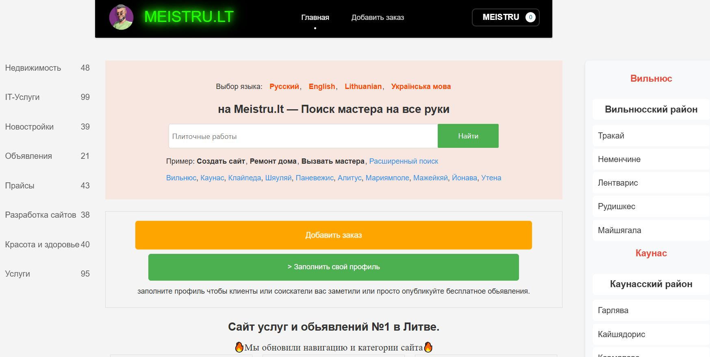

---

## 🎯 Для каких сайтов идеально подходит

- Доски объявлений услуг мастеров
- Сайты строительных и ремонтных компаний
- Платформы фриланс-услуг в Литве и Европе
- Мультиязычные проекты (русский, украинский, английский, норвежский)

---

## 🚀 Установка шаблона

1. Скачай папку `MEISTRU` целиком
2. Загрузи её в `/templates/` на своём сервере DLE
3. В админ-панели DLE → **Настройки** → **Шаблоны** выбери `MEISTRU`
4. Очисти кэш шаблонов и сайта
5. Готово! 🎉

**Рекомендуется** использовать вместе со скриптами автопоста из этого же репозитория (`create-multilang.php`).

---

## 🛠 Технические характеристики

- DLE версии: 14.x и выше
- PHP: 7.4+
- CSS: чистый, без тяжёлых фреймворков (только минимальный Bootstrap 5 где нужно)
- Шрифты: Google Fonts + локальные
- Изображения: WebP + lazy loading
- Скорость: PageSpeed 95+ на мобильных

---

## 📸 Скриншоты

---

## 📄 Лицензия

MIT License — можно использовать бесплатно в личных и коммерческих проектах.

---

⭐ **Поставь звезду репозиторию**, если шаблон тебе понравился!

**Разработано специально для meistru.lt** ❤️  
Если нужно доработать (добавить новые блоки, изменить цвета, сделать тёмную тему) — пиши, сделаю быстро.

---

**Автор:** Ruslan Bilohash  
**Дата обновления:** 27 февраля 2026
